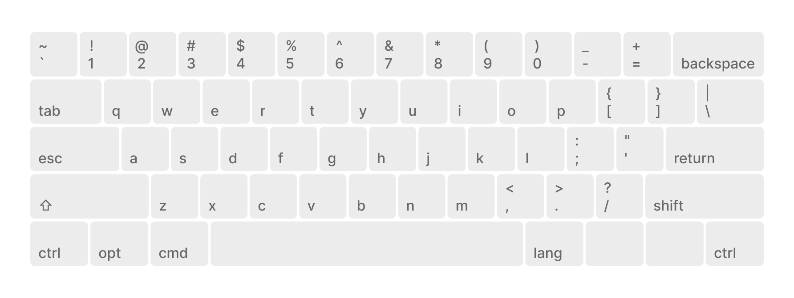
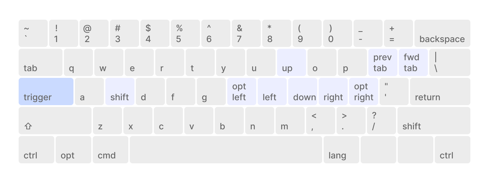
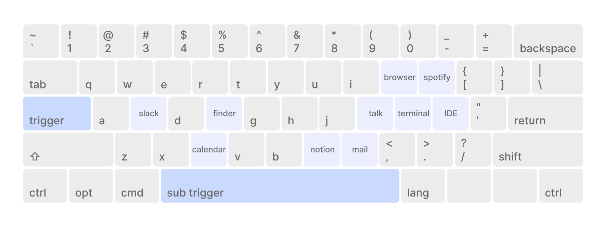
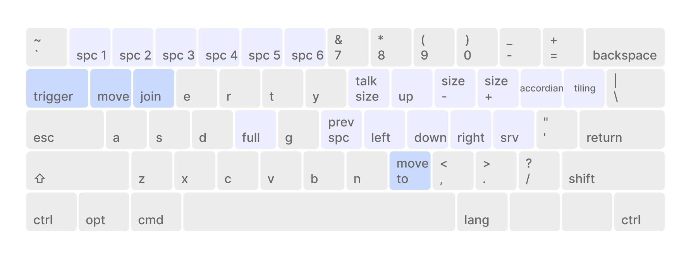

# Karabiner Elements Custom Configuration

## Overview

This setup creates a powerful keyboard shortcut system using custom modifiers and layers for **aerospace**:

- **Main Trigger Key**: Caps Lock is remapped to function as Escape when tapped, and as a "main_trigger" modifier when held
- **Aerospace Trigger Key**: Tab is remapped to function as Tab when tapped, and as a "aerospace_trigger" modifier when held
- **Right Command**: Remapped to F19 for chaning input source

## 4 Mod for key mapping

> Window management is acheived using **aerospace**

### Default Mod



- remap `caps_lock` to `esc` on single click
- remap `right_cmd` to `f19` for chaning input source

### Main Trigger - Arrow Mod



- hold `main_trigger` key to activate arrow mod
- `prev_tab`, `fwd_tab` works only on arc browser

### Main Trigger - Launch Mod



- hold `main_trigger` key and `sub_trigger` key to activate launch mod

### Aerospace Trigger



- hold `aerospace_trigger` key to activate aerospace mod
- hold `move` sub trigger key to move node
- hold `join` sub trigger key to join node
- hold `move to` sub trigger key to move window to another workspace

## Requirements

- [Karabiner Elements](https://karabiner-elements.pqrs.org/) installed
- [Aerospace](https://github.com/nikitabobko/AeroSpace) installed

## Setup

1. Install Karabiner Elements
2. Run the following command to create symlinks:

```bash
# from repo's root directory
make karabiner

# or just do it yourself
ln -sf $(DOTFILES_ROOT)/karabiner $(HOME)/.config/karabiner
```
